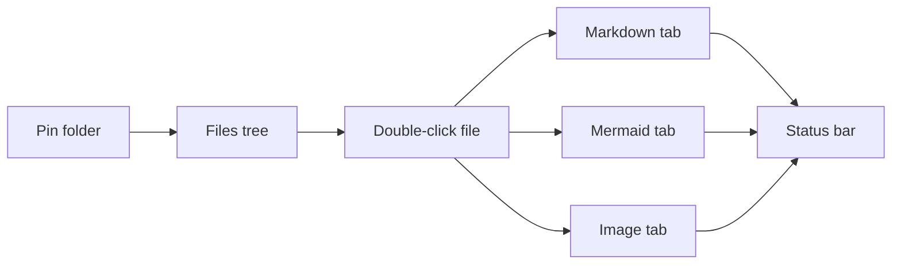
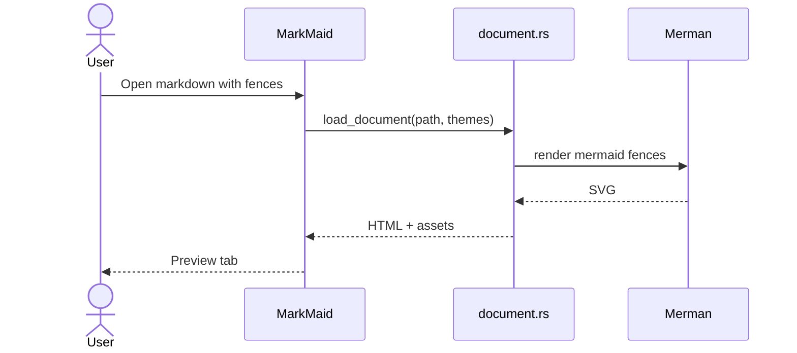
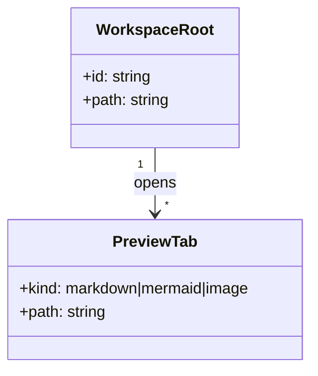
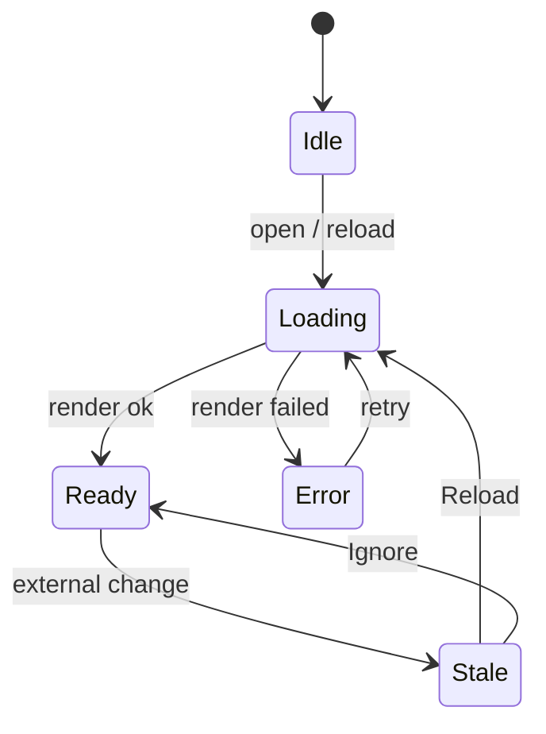

# Mermaid in Markdown

Fenced `mermaid` blocks are compiled to SVG by MarkMaid’s native Merman
renderer during document load. Theme changes should re-render open previews.

## Flowchart

## Sequence diagram

## Class diagram

## State diagram

## Tip

For a diagram-only tab (zoom, pan, fullscreen, export), open the standalone
files under `diagrams/` instead of this Markdown page.
