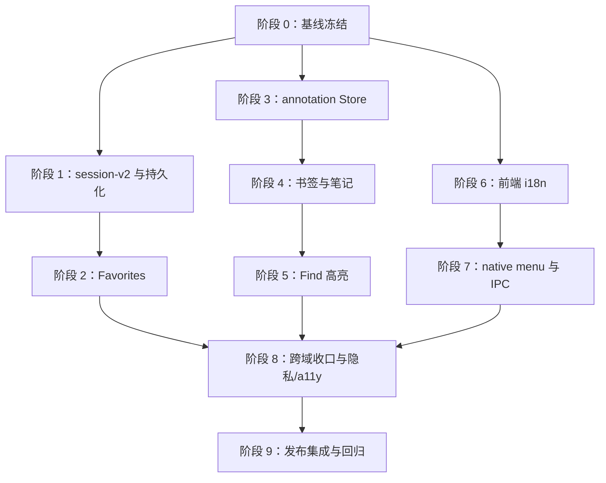

# MarkMaid v0.1.9 分步实施计划

> **文档性质**：实施运行手册，而不是新的产品范围定义。  
> **产品契约**：以 [`v0.1.9_plan.md`](v0.1.9_plan.md) 的锁定契约为准；本文件把它拆成可独立评审、可独立验收的实现阶段。  
> **基线**：v0.1.8，版本元数据当前为 `0.1.8`；开始功能实现前必须先发布包含 future-schema 禁写保护的 v0.1.8。  
> **目标版本**：`0.1.9`。  
> **原则**：先建立数据和迁移边界，再接入 UI；先完成纯函数和测试，再接入副作用；每阶段结束都必须通过质量门禁。

## 1. 版本目标

v0.1.9 是一次“阅读连续性 + 本地化”版本，不是搜索版本，也不是编辑器版本。用户最终应能：

1. 将 Markdown 和独立 Mermaid 文档加入 Favorites，并在 Quick Open、Command Palette 中发现和切换；
2. 在不修改源文件的前提下添加书签、基于 Find 当前匹配创建高亮、添加短文本笔记；
3. 重启后恢复有限的文档访问历史和关闭标签历史；
4. 在 English 与 Simplified Chinese UI 之间切换，`system` 模式能正确回退；
5. 从 v0.1.8 的 session-v1 数据平滑迁移到 session-v2；损坏、过期、缺失或歧义数据不会静默破坏源文件或覆盖不可读 Store。

### 1.1 成功定义

以下条件全部满足才算 v0.1.9 完成：

- Favorites 与 Recents 是两个独立的数据集合；Favorites 上限为 50，按最新加入顺序排列；
- Favorites、历史记录、locale 都进入 session-v2；annotations 使用独立的 `markmaid-annotations.json` Store，不进入 session；
- annotation 只保存应用元数据，永远不写入 Markdown、Mermaid、HTML 注释、front matter 或源文件旁的 sidecar 文件；
- 高亮只从当前 Find 匹配创建，保存 UTF-16 offset、上下文和 SHA-256；源文件变化后只能精确恢复或唯一重定位，零匹配/多匹配都显示 stale；
- `system`、`en`、`zh-Hans` 三种 locale 值有明确解析和英文逐 key fallback；文档内容、代码块和用户笔记正文不翻译；
- `CI=true pnpm check`、IPC drift check、现有性能 smoke、Rust 测试、手工 QA 和 release artifact 检查全部通过；
- `src/main.ts` 继续保持 composition root 且不超过 4,000 行；新增 annotation/i18n view logic 不回流；
- README、CHANGELOG、ROADMAP、发布说明和发布 checklist 与实际行为一致。

## 2. 当前基线与硬约束

### 2.1 已有实现

| 领域 | 当前实现 | v0.1.9 的接入点 |
| --- | --- | --- |
| 版本 | `package.json` 为 `0.1.8`；版本脚本同步 npm、Tauri、Cargo manifest、Cargo lock | 阶段 0 基线后、写入 session-v2 前先执行 `pnpm release:prepare -- 0.1.9` |
| 前端状态 | `AppState` 已有 runtime 的 `closedTabsHistory`、`documentVisitHistory`、`documentVisitHistoryIndex`；当前 Reopen 会在异步结果前消费记录 | 保留 bounds/排序语义，但修正失败项的事务式消费和显式 Remove |
| session | `PersistedSessionV1` 为 `version: 1`；`src/session/migrate.ts` 负责纯迁移和归一化 | 增加 v1 → v2，并保持 Store I/O 在 `src/app/persistence.ts` |
| Store 边界 | `loadSessionForBootstrap` 区分 Store open/load 失败与普通非法值；不可读 Store 不被覆盖 | annotations 复用同样的失败语义，但独立 Store、独立禁写状态 |
| Quick Open | `src/ui-logic.ts` 当前有 `tab`、`workspace`、`recent` 来源和统一排序/去重 | 增加 `favorite`、`scope: "all" | "favorites"`，不建立第二套 picker |
| Command Palette | `src/commands.ts` 有静态 `CommandId` catalog，控制器位于 `src/app/command-palette-controller.ts` | 增加静态命令；动态路径只作为 overlay 行，不进入 `CommandId` |
| Find | `src/app/document-find-view.ts` 基于 source match 和 sourcepos 映射到渲染 DOM | 复用当前 source offset，不依赖任意 DOM 选区 |
| native IPC | `src-tauri/src/ipc.rs` 是生成 bindings 的单一命令注册点；原始 `invoke` 只应存在于生成文件 | 新增 `set_ui_locale` 后重新生成并检查绑定 |
| native menu | `src-tauri/src/lib.rs` 的 `build_menu` 当前包含 English 的 MarkMaid-authored labels，并维护 Recents/Reopen 状态 | 增加 locale 状态和菜单重建；保留 macOS 标准 role item |
| 质量门禁 | `scripts/check.sh` 依次运行版本检查、`ipc:check`、前端测试、性能 smoke、构建、Rust 测试、fmt、Clippy | 每个实现阶段都运行；发布阶段再运行完整 release gate |

### 2.2 不可突破的边界

- 不实现 Workspace Switcher、全文搜索、backlinks、broken-link report、wikilinks；这些属于 v0.2 候选工作；
- 不实现 Markdown 编辑、保存、自动保存、冲突解决或持续文件 watcher；
- 不实现 iCloud、Git、云同步、账户、遥测、自动诊断上传；
- 不支持图片 Favorites、Settings Favorites；Favorites 只接受 ready Markdown 和独立 Mermaid；
- 不做任意 DOM 文本选择高亮；渲染 Markdown 没有可靠的一一对应 source mapping；
- 不改变 `tab.html` 来画高亮，不把 annotations 混入 HTML/PDF 导出；
- 不加入 English/Simplified Chinese 之外的 locale；不强行把繁体中文转换为简体中文；
- 不在本版本引入 Developer ID 签名或 notarization。

## 3. 总体依赖关系



推荐严格按阶段推进。阶段 3 与阶段 6 在阶段 0 后可以并行开发，但合并前仍按上图的依赖顺序验收；如果团队只有一条开发线，按 0 → 1 → 2 → 3 → 4 → 5 → 6 → 7 → 8 → 9 执行。

## 4. 数据所有权与契约

### 4.1 session-v2

`markmaid-state.json` 只负责应用 session。它不保存 annotation。

```text
PersistedSessionV2 {
  version: 2
  tabs: PersistedTab[]
  activeTabKey: string | null
  theme: ThemeMode
  ...existing v1 optional fields
  externalOpenTargetId?: string
  favorites: FavoriteEntry[]
  uiLocale: "system" | "en" | "zh-Hans"
  documentVisitHistory: DocumentNavigationEntry[]
  documentVisitHistoryIndex: number
  closedTabsHistory: ClosedTab[]
}

FavoriteEntry {
  path: string       // canonical absolute path
  kind: "document" | "mermaid"
  addedAt: number    // epoch milliseconds
}
```

规则：

- v1 → v2 迁移补齐 `favorites: []`、`uiLocale: "system"`、两个空历史和 `documentVisitHistoryIndex: -1`；
- 未知、缺失或未来版本 fail closed，沿用现有 migrator 的默认状态行为；
- migration 只做值验证，不做文件系统 I/O、`canonicalize` 或存在性判断；
- Favorites 按 canonical path 去重，最新在前，最多 50 条；非法 path、非法 kind、非法 timestamp 丢弃；
- 重复 path 保留 `addedAt` 最大的合法项，按 `addedAt` 降序；timestamp 相同时保持首次输入顺序。timestamp 必须是有限、非负整数；
- 两个历史沿用当前上限：visit history 50，closed-tab history 20；迁移和 reducer 都要限长；
- 历史目标文件不存在时仍保留，只有用户在失败打开后的 Remove 动作才删除；
- Focus Mode 仍是 runtime-only，不写入 session；
- `toPersistedSession` 始终写入当前 version 2，不能写出 v1 或把 annotations 混入其中。

### 4.2 annotation Store v1

Store key 固定为 `annotations`，文件名固定为 `markmaid-annotations.json`。文档 key 为 canonical path。

```text
AnnotationStoreV1 {
  version: 1
  documents: Record<string, AnnotationsByPath>
}

AnnotationsByPath {
  bookmarks: Bookmark[]
  highlights: Highlight[]
  notes: Note[]
}

Bookmark {
  id: string
  path: string
  title: string              // <= 120 UTF-16 code units
  scrollTop: number
  fragment?: string
  createdAt: number
  updatedAt: number
}

Highlight {
  id: string
  path: string
  start: number              // UTF-16, inclusive
  end: number                // UTF-16, exclusive
  quote: string              // <= 512 code units
  prefix: string             // <= 64 code units
  suffix: string             // <= 64 code units
  sourceHash: string         // SHA-256 hex
  colorToken: "yellow" | "green" | "blue" | "pink"
  createdAt: number
  updatedAt: number
}

Note {
  id: string
  path: string
  body: string               // plain text, <= 4,096 code units
  bookmarkId?: string
  createdAt: number
  updatedAt: number
}
```

固定上限：每路径每类 50 条、全局每类 500 条、序列化 Store 不超过 1 MiB。超限 mutation 必须拒绝并提示，不能静默截断既有数据。每个合法记录使用 `crypto.randomUUID()`；加载时重复 ID 保留第一个合法记录。

### 4.3 locale

```text
UiLocalePreference = "system" | "en" | "zh-Hans"
ResolvedUiLocale = "en" | "zh-Hans"
```

`system` 解析规则：

- 严格按 preferred-language 顺序遍历；`zh`、`zh-Hans`、`zh-CN`、`zh-SG` 选择 `zh-Hans`；
- 遇到 English match 立即选择 `en`；`zh-Hant`、`zh-TW`、`zh-HK`、`zh-MO` 和其他 unsupported language 继续检查下一个候选；
- 全部候选耗尽后回退 `en`；因此 `en-US, zh-CN` 为 English，`zh-Hant, zh-CN` 为 Simplified Chinese；
- 生产中文 catalog 必须满足与 English 完全相同的 `MessageKey` 集合；测试 catalog 允许部分键并逐键回退 English。

## 5. 分阶段实施

### 阶段 0：基线冻结与实现护栏

**目的**：在新增持久化数据之前确认 v0.1.8 的基线可重复，避免把旧回归误判为新功能问题。

### 工作项

1. 确认工作分支从 v0.1.8 发布后的 `main` 开始；阶段 0 保持 0.1.8，阶段出口通过后第一笔 feature commit 必须先同步到 0.1.9。
2. 运行 `node scripts/version.mjs --check 0.1.8`，确认四个版本文件同步。
3. 运行 `pnpm ipc:check`，确认生成的前端 IPC catalog 无漂移。
4. 运行一次 `CI=true pnpm check`，保存本地结果作为比较基线；不设置新的 wall-clock CI 阈值。
5. 建立 v1 fixture：最小 session、完整 session、旧 `mermaidTheme`、坏 tab、超长 recent、未知 version。
6. 明确每个新模块的 owner：状态 reducer 不拥有 Store I/O，view 不直接读写 Store，native menu 不知道 annotation 数据。
7. 在 v0.1.8 中先补并发布 future-schema 保护：已解析出整数 version、但不是当前支持版本时，恢复默认 UI 只能进入 session read-only recovery，不能把默认值写回原 Store。
8. 在上述 v0.1.8 发布前，任何 v0.1.9 app/dev smoke 只能使用隔离 app-data profile 或一次性 Store 副本，禁止直接打开真实用户 Store；自动测试必须证明 unsupported Store 未发生 `set`。

### 主要文件

- `src/types.ts`
- `src/state.ts`
- `src/session/migrate.ts`
- `src/app/persistence.ts`
- `src/commands.ts`
- `src/ui-logic.ts`
- `src-tauri/src/ipc.rs`
- `src-tauri/src/lib.rs`
- 对应的现有 `*.test.ts` 与 Rust tests

### 阶段出口

- 基线质量门禁通过；
- v0.1.8 future-schema no-overwrite 测试通过且发布完成；
- v1 fixture 可以独立运行；
- 后续所有阶段都能在失败时定位到 feature commit，而不是未记录的基线漂移。

### 阶段 1：session-v2、迁移和历史持久化

**依赖**：阶段 0。  
**目的**：先让数据模型和重启语义稳定，再接入 Favorites UI。

### 1.1 类型与 schema

0. 先运行 `pnpm release:prepare -- 0.1.9` 并单独提交四个同步版本文件；任何会写 session-v2 的 dev build 都必须自报 0.1.9。
1. 在 `src/types.ts` 增加 `FavoriteEntry`、`UiLocalePreference` 和 `PersistedSessionV2`，保留 v1 类型用于迁移输入。
2. 将 `favorites`、`uiLocale` 纳入 `AppState`；确认 runtime history 字段继续由现有 reducer 管理。
3. 在 `src/session/schema.ts`（若现有 schema 文件适合则放入该文件）集中定义上限和纯归一化函数，不把边界散落在 UI。
4. 为 Favorite path 使用 canonical absolute path；migration 只验证绝对路径格式，不主动访问磁盘。

### 1.2 迁移管线

1. 保留公共入口 `migrateSession(candidate)`，内部增加 `migrateV1ToV2`。
2. `version: 1` 进入 v1 归一化后补默认字段；`version: 2` 走 v2 归一化；公共迁移结果区分 `ready(current)`、`invalid` 和 `unsupported(version)`。缺失/畸形数据走 writable defaults；已解析出的其他整数 version 走 read-only recovery、显示一次安全 notice 并禁用 session persistence。
3. 保持 `fromPersistedSession` 接受“当前迁移结果”，不要让 Store I/O 进入 migrator。
4. `toPersistedSession` 只产生完整、可序列化的 v2 shape。
5. 明确 session Store open/parse failure 的行为：显示一次隐私安全 notice、禁用本次进程的 persistence、不覆盖 unreadable file；普通字段非法只做默认化/丢弃坏项。

### 1.3 历史接入

1. 保留 `recordDocumentVisit`、`updateDocumentVisit`、`moveDocumentVisit` 的现有顺序/边界语义；修改 `reopenClosedTab` 的消费时机，因为当前实现会在异步打开结果未知时先 pop，违反“失败项保留到显式 Remove”的契约。
2. reducer 与 migration 双重限制 50/20 上限，并修复 index：空历史为 `-1`，非空 index 必须落在有效范围。
3. bootstrap 时不做历史目标的文件系统扫描；在 Back/Forward/Reopen 真正打开时沿用现有 preview path 检查。
4. 失败打开继续保留历史项，只有明确的 Remove action 才移除并持久化。
5. Back/Forward 可把 index 移到失败项以承载 Retry/Remove；Remove 后 previous-first、否则 next，并 clamp index。Reopen 先 peek，只有 ready preview 建立后才消费对应 closed entry；失败不得产生重复 error tab。

### 1.4 测试与出口

必须覆盖：

- v1 最小/完整 fixture → v2；
- v2 完整 round-trip；
- missing/malformed version 走 writable defaults；unknown/future integer version 走 read-only recovery 且不覆盖；
- favorites 缺失、非法、重复、超过 50；
- history 超过 50/20、空 history、越界 index、缺失目标；
- legacy `mermaidTheme` 仍按 v0.1.8 规则忽略；
- Store open failure 不覆盖原文件，session persistence disabled；
- unsupported future version 不调用 Store `set`，不会在 downgrade/开发切换时覆盖新 schema；
- 重启后 tabs、scroll、workspace、recent、history、favorites、locale 均从正确字段恢复。

**出口门禁**：`pnpm test`、`pnpm build`、`cargo test --manifest-path src-tauri/Cargo.toml`，随后完整 `CI=true pnpm check`。

### 阶段 2：Favorites 全链路

**依赖**：阶段 1。  
**目的**：提供一个最小、可持久化、没有第二套搜索面的收藏工作流。

### 2.1 纯状态层

在 `src/favorites.ts` 实现并测试：

- `normalizeFavorites`：校验 path/kind/time、去重、排序、截断；
- `toggleFavorite`：存在则删除，不存在则插入 index 0；重新加入获得新 `addedAt`；
- `removeFavorite`：显式删除；
- `rewriteFavoritePaths`：workspace rename 成功后重写 prefix；
- `removeFavoritesUnderPrefix`：Trash 成功后删除被移除路径前缀下的 app metadata；
- `canFavorite`：只允许 ready Markdown/standalone Mermaid，不允许 image、Settings、loading/error。

不要把是否存在文件的检查放入纯 reducer。缺失文件仍可作为 favorite 展示。

### 2.2 UI 入口

1. 在现有 tab context menu 加入 Toggle Favorite，复用已有 roving keyboard、focus restore、live-region announcement。
2. 在 `src/commands.ts` 加入静态 ID：
   - `file.toggle-favorite`
   - `file.open-favorites`
3. `file.toggle-favorite` 只在当前 active tab 是 favoritable ready document/mermaid 时 enabled；否则按现有 availability 机制 hidden/disabled。
4. `file.open-favorites` 只打开 Quick Open 并设置 `scope: "favorites"`，不新增 picker、排序器或动态 CommandId。

### 2.3 Quick Open

1. 将 `QuickSwitcherItem.kind` 扩展为 `favorite`。
2. 将 `buildQuickSwitcherItems` 的输入扩展为 favorites 和 scope。
3. 固定优先级：**open tabs → favorites → workspace query matches → recents**。
4. duplicate path 采用 first source wins；empty query 显示 tabs、favorites、recents，workspace 仍只在 query 下出现。
5. favorites 使用与其他来源相同的 path/name matching，激活时复用现有 open/focus path。
6. 从 favorites scope 显式清除 scope 或关闭 overlay 后回到 `all`；不能保留隐形 scope 导致普通 Quick Open 缺少结果。
7. favorites scope 必须显示 localized scope chip 和键盘可达的 clear action；空 query 时按 Backspace/Delete 也可回到 `all`。关闭 overlay 后丢弃 scope，普通 `Cmd+P` 始终从 `all` 打开；没有 Favorites 时 palette command disabled 并显示 localized reason。

### 2.4 路径生命周期

- workspace rename 前先纯计算 session metadata rewrite；annotation 接入后还要预检目标 bucket collision 和重写后的 count/byte caps。预检失败时不调用 native rename，不做隐式 merge/overwrite。
- workspace rename native 成功后，阶段 2 同时重写 favorites、visit history 和 closed-tab history；annotation document keys 在阶段 8、annotation Store 已接入后统一重写。文件系统与两个 Store 不宣称原子提交；后续 Store 写失败时不回滚已完成的文件操作，而是保留内存状态、禁用对应 Store 并显示 partial-save notice。
- workspace Trash native 成功后，阶段 2 先完成明确警告，再清理 Favorites/历史 metadata；annotation metadata 的清理在阶段 8 完成。
- 外部删除不自动清理 favorite 或历史；失败打开提供 Remove，由用户决定。


### 2.5 测试与出口

- reducer 的 cap/order/dedupe/toggle/remove/path rewrite；
- tab menu 键盘操作、不可用状态和 focus restore；
- Quick Open 精确优先级、跨源 dedupe、empty/query、favorites-only scope；
- Command Palette availability 和执行后状态；
- quit/relaunch 后 favorite 仍存在；
- rename、Trash、外部删除的不同语义；
- Favorites 不改变源文件 bytes。

**出口门禁**：阶段 1 测试 + 新增 frontend tests + 手工 smoke 一次。

### 阶段 3：annotation Store 与存储边界

**依赖**：阶段 0；阶段 4 依赖本阶段。  
**目的**：在任何 annotation UI 之前先把独立 Store 的读取、归一化、禁写和容量边界做正确。

### 3.1 schema 与归一化

在 `src/annotations/schema.ts` 实现：

1. `AnnotationStoreV1`、`AnnotationsByPath`、Bookmark/Highlight/Note 类型；
2. 每记录字段合法性检查、长度裁剪策略和 invalid-record 丢弃策略；
3. ID 去重，保留第一个合法记录；
4. 每路径/全局数量上限；
5. 序列化后 1 MiB guard；
6. path key 的 canonical absolute path 验证；
7. 不做 filesystem I/O，不存 document body，不存 full rendered HTML。
8. record.path 必须与 document bucket canonical path key 完全一致；rename 同时改 key 与 record.path。
9. 1 MiB 精确定义为 `TextEncoder` 测量 `JSON.stringify({ annotations: normalizedStore })` 的 UTF-8 bytes。
10. ID 在全部 path/annotation kind 间全局唯一；按 stored bucket key order、array order 确定“第一个”。新增项 newest-first，编辑不改变顺序。
11. timestamp 是有限非负整数且 `updatedAt >= createdAt`；`bookmarkId` 只能指向同 path bookmark。加载/删除 bookmark 时清除 dangling link，但保留 Note 作为 path note。

对于用户已存在的数据，不允许为了过 cap 而静默删除旧记录。加载到 otherwise-valid 但已超 count/1 MiB cap 的 Store 时，完整保留并显示 normalized model，但进入 annotation recovery-only mode；只允许显式删除 metadata。某次删除 candidate 使完整 model 回到限制内时，先持久化该 candidate，再恢复普通 mutation。导致超限的新 mutation 必须在 immutable candidate 上失败并给出可行动 notice。

### 3.2 Store controller

在 `src/app/annotation-controller.ts` 建立 Store scheduling 和状态转换：

1. 以 `{ autoSave: 150 }` 打开 `markmaid-annotations.json`；
2. open/parse failure：使用空的 in-memory model，禁用本进程 annotation mutation，显示一次 privacy-safe notice，不覆盖 unreadable file；
3. valid Store 中单个 document bucket 损坏：隔离并丢弃该 bucket，其他 bucket 继续可写；
4. mutation 前做 normalize、count guard、serialized-size guard；
5. 对 path rename/trash 提供纯 path rewrite/remove 方法；
6. controller 通过依赖注入接收 Store、notice、persist callback，禁止直接引用 `main.ts` 可变全局。
7. Store writer 必须串行化：in-flight write 期间的新变化只标记 dirty，结束后最多再写一次最新 snapshot；write rejection 禁用后续写入、清理 timer、只提示一次且不能产生 unhandled rejection。

### 3.3 统一 annotation overlay

在 `src/app/annotation-view.ts` 设计一个共享 overlay：

- `role="dialog"`，Tab/Shift+Tab focus trap，Escape 关闭并恢复 opener focus；
- Arrow/Home/End 移动列表 selection，Enter 激活；
- 删除必须在同一个 dialog 内二次确认；
- bookmark、highlight、note 行统一展示 stale/不可跳转状态；
- icon-only controls 必须有 localized accessible name；
- 结果变化走既有 live-region announcement；
- 动态路径和 annotation ID 不进入静态 CommandId。

### 测试与出口

- corrupt top-level Store、corrupt bucket、duplicate IDs；
- 每路径/全局/1 MiB caps；mutation rejection 不改变既有数据；
- Store 失败后 favorites/session 仍然可用；
- overlay role、focus trap、Escape restore、keyboard selection、confirm delete；
- diagnostics 不包含 note body、quote、annotation path。

**出口门禁**：schema/controller/view tests 通过；失败 Store 不被覆盖的行为有可重复测试。

### 阶段 4：书签与笔记

**依赖**：阶段 3。  
**目的**：先交付不涉及 source offset 的两个 annotation 类型，验证 overlay 和 Store 语义。

### 4.1 Bookmark

1. 只对当前 ready document/mermaid tab 开启 Add Bookmark；
2. 捕获当前 `scrollTop`；
3. 从当前 preview DOM 找最近的 preceding heading `id`，有则保存 `fragment`；
4. title 使用用户输入或 derived heading，限制 120 UTF-16 code units；
5. 跳转优先 fragment，fragment 不可用时 fallback 到 scrollTop；
6. 跳转前按现有 open/focus path 激活对应 tab；目标缺失时保持记录并显示 Remove。
7. title 在 trim 后为空时拒绝；保存时将 CRLF/CR 统一为 LF。按 UTF-16 code-unit 计数，但任何 UI truncation 都不能切断 surrogate pair。

### 4.2 Note

1. Note 是 plain text app-local data，最多 4,096 UTF-16 code units；
2. Note 可挂到 path 或 Bookmark，不允许写入 Markdown/front matter/同目录文件；
3. 编辑/删除均经过同一 annotation controller 和容量 guard；
4. Copy Details、Copy Diagnostics、export payload 不得包含 note body。
5. Note 只可从 ready Markdown/Mermaid 或现有 bookmark 创建；trim 后为空时拒绝，保存内容规范化换行但不翻译、不做 HTML escape。escape 只发生在具体渲染 sink。

### 4.3 Command Palette

加入静态 ID：

- `annotations.add-bookmark`
- `annotations.show-bookmarks`
- `annotations.add-note`
- `annotations.manage`

`annotations.manage` 打开共享 overlay；动态 bookmark/note 行留在 overlay 内。命令 labels、sections、disabled reasons、keywords 交给后续 i18n factory，不在本阶段复制硬编码字符串。

### 测试与出口

- bookmark fragment 命中、fragment 缺失、scroll fallback；
- note 长度上限、空内容策略、bookmark 关联和删除；
- open/rename/Trash/missing target；
- Command Palette enabled/disabled/overlay activation；
- 源文件 SHA-256 或 bytes 在每次操作前后相同。

### 阶段 5：Find-based 高亮

**依赖**：阶段 4、现有 `src/search.ts` 和 `src/app/document-find-view.ts`。  
**目的**：在已有 source-backed Find 上构建可验证的高亮，不假设 DOM 文本与 source 字符一一对应。

### 5.1 创建高亮

1. 仅允许 ready Markdown tab；Mermaid/image 禁用；
2. `annotations.highlight-find-match` 打开现有 Find overlay，mode 为 `highlight`；
3. Add Highlight 只有在 current match 存在时 enabled；
4. 从当前 `SourceMatch` 读取 zero-based UTF-16 `start/end`、精确 quote 和前后文；`DocumentSearchMatch`/Find controller 必须显式保留当前 `start/end`，不能只依赖现有 `sourceIndex` 或 DOM mark；
5. 以 `TextEncoder` 对 ready tab 中 exact `source` 字符串编码为 UTF-8，再计算 SHA-256；不得先改换行或 Unicode normalization；
6. 由用户确认 colorToken 后持久化；取消不产生 mutation。

### 5.2 恢复与 stale

打开或 Reload 后，对每条 highlight：

1. 先检查 sourceHash + 原 offset 处的 quote 是否完全匹配；
2. 不匹配时搜索 `prefix + quote + suffix`；
3. 恰好一个匹配则 re-anchor、更新 offsets/sourceHash/updatedAt；
4. 零个或多个匹配均标记 stale，绝不在多个候选中猜一个；
5. stale 状态可以查看、删除或重新从当前 Find match 创建，但不自动改源文件。
6. 每个 document revision 只计算一次 source hash；每次最多处理该 path 的 50 条 highlight，并在记录间 yield。复用 generation/cancellation guard，tab switch/reload/close 后旧任务不得 apply；同一文档的全部 re-anchor 结果合并成一次 immutable mutation 和一次 scheduled Store write。

### 5.3 预览装饰与导出

1. 在 `src/app/highlight-decorations.ts` 管理 preview-only CSS/overlay；
2. 不修改 ready tab 的 `html`，不把 `<mark>` 写回 renderer 结果；
3. 重新渲染、切换 tab、切换 locale 时移除并重建装饰；
4. HTML/PDF export 使用未注入 annotation 的 rendered HTML，测试 payload 中不存在 highlight/note 内容。

### 5.4 测试与出口

- exact offset 命中；
- source 修改后唯一 re-anchor；
- 零匹配 stale；
- 多匹配 stale；
- UTF-16 surrogate pair 边界；
- Find overlay 无 current match 时 disabled；
- deferred code、Markdown formatting、sourcepos 映射不改变当前 Find 行为；
- preview decoration 不污染 `tab.html`；
- export 不包含 annotation。
- large-document + 50 highlights structural smoke：单 revision 只 hash 一次、最多 50 次 re-anchor、支持 cancellation/stale generation rejection、只产生一次 batched mutation；不增加 wall-clock CI threshold。

**出口门禁**：现有 Find tests 和新 highlight tests 一起通过；手工验证 source bytes 未变。

### 阶段 6：前端 i18n

**依赖**：阶段 0；可以与阶段 3/4 并行，但必须在阶段 7 前完成。  
**目的**：把可见 UI 文本从散落 literals 迁移到类型安全 catalog，同时不重新加载当前文档。

### 6.1 Catalog 与 resolver

在 `src/i18n/messages.ts` 与 `src/i18n/index.ts` 实现：

1. English catalog 作为完整 `MessageKey` authority；
2. Simplified Chinese catalog 编译期满足 `Record<MessageKey, string>`；
3. `resolveUiLocale(preference, languages)` 遵守第 4.3 节规则；
4. `createTranslator(locale)` 支持插值和 per-key English fallback；
5. translator 只返回 plain text，并校验 placeholder；它不统一 HTML escape。用户 path、quote、note body 等值必须在具体 sink 按 `textContent`、HTML text、attribute 或 URL 上下文转义，避免漏转义和 double escaping；
6. 不翻译文档 source、渲染内容、code fence、用户笔记正文。
7. locale negotiation 按 `navigator.languages` 顺序：首个 Simplified-Chinese match 返回 `zh-Hans`，首个 English match 返回 `en`，Traditional Chinese 和其他 unsupported language 继续检查，耗尽后才 fallback `en`。覆盖 `en-US,zh-CN` 与 `zh-Hant,zh-CN` 两种顺序测试。

### 6.2 覆盖范围

按以下顺序提取，避免遗漏高频和失败路径：

1. `src/main.ts` shell chrome、tab context、status、empty/error/actionable notices；
2. `src/app/quick-open-view.ts`、`command-palette-view.ts`、`document-find-view.ts`、`annotation-view.ts`；
3. Settings labels、locale selector、validation/disabled reasons；
4. existing accessibility labels、tooltips、live-region messages；
5. `src/commands.ts`：将 `COMMAND_CATALOG_METADATA` 改为 locale-derived factory；
6. English keywords 继续附加到中文 keywords，保持肌肉记忆和确定性搜索。

### 6.3 locale 切换

1. 在 Settings 增加 `uiLocale` preference；
2. 更新 session-v2 后重建 shell/menu/catalog；
3. 当前 preview DOM node 必须保持 attached，scrollTop、focus 和 active tab 不变；
4. 不因为 locale 变化触发 Markdown/Mermaid reload；
5. 在切换过程中保留 Recents 与 Reopen availability。
6. preference 为 `system` 时监听 `window.languagechange` 并执行同一 DOM-preserving 更新，但持久值仍是 `system`；显式 locale 忽略该事件。应用生成的日期/数字使用 resolved locale 的 `Intl` formatter。

### 测试与出口

- English/Chinese key parity；
- sparse test catalog 的 per-key English fallback；
- system language resolution，包括简体、繁体和普通非中文候选；
- interpolation escaping；
- Command Palette 搜索 label/keyword/section/disabled reason；
- Settings 保存/恢复三种 preference；
- locale 切换前后 preview DOM identity、scroll、focus、active tab；
- overlay、empty/error、VoiceOver name 无英文遗漏（以人工 inventory 为最终补充）。

### 阶段 7：native menu 与 typed IPC 同步

**依赖**：阶段 6。  
**目的**：让 MarkMaid 自己创建的 macOS 菜单跟随前端 locale，同时不触碰 macOS 标准 role item。

### 7.1 Rust 状态与命令

1. 新建 `src-tauri/src/menu_locale.rs`，定义 `UiLocaleState` 和 English/Simplified Chinese menu label 映射；
2. 增加 `set_ui_locale({ locale: "en" | "zh-Hans" })` Tauri command；
3. 加入 `src-tauri/src/ipc.rs` 的唯一 command builder；
4. 重新生成并提交 `src/generated/tauri-bindings.ts`；
5. 所有新增前端调用使用 generated binding，禁止手写 raw `invoke`。

### 7.2 menu 重建

1. `build_menu` 从 `UiLocaleState` 读取当前 resolved locale；
2. 本地化 MarkMaid-authored 的 app/file/view/menu/submenu labels；
3. 保留 Tauri/macOS 提供的 About、Services、Hide、Quit、Undo/Redo、Cut/Copy/Paste、Full Screen、Window roles；
   这些标准 role item 跟随 macOS system language，允许与 MarkMaid 选择的 locale 不同；发布说明不得声称它们由应用 locale 控制。
4. preference bootstrap 和变更时调用 `set_ui_locale`，重建菜单；
5. 重建时保留 Recents 文档和 Reopen enabled 状态，不清空 native state；
6. command event IDs 保持稳定，locale 只改变 label，不改变行为。

### 7.3 测试与出口

- Rust label mapping、locale state 默认值、无效 locale 拒绝；
- native menu 重建后 Recents/Reopen 状态保持；
- frontend generated binding 和 `pnpm ipc:check`；
- locale bootstrap、切换、重启恢复；
- native menu event ID 在两种 locale 下仍触发相同前端 action。

**出口门禁**：`pnpm ipc:generate && pnpm ipc:check`，Rust tests、Clippy、完整 `CI=true pnpm check`。

### 阶段 8：跨域收口、隐私和可访问性

**依赖**：阶段 2、5、7。  
**目的**：把分阶段功能在路径生命周期、错误状态、诊断、导出和辅助技术上收口。

### 8.1 path lifecycle matrix

逐项验证以下操作影响所有相关 metadata：

| 操作 | Favorites | visit history | closed tabs | annotations |
| --- | --- | --- | --- | --- |
| successful workspace rename | rewrite prefix | rewrite prefix | rewrite prefix | rewrite document keys |
| successful workspace Trash | remove under prefix after warning | remove under prefix after warning | remove under prefix after warning | remove under prefix after warning |
| external deletion | retain | retain | retain | retain |
| failed native mutation | unchanged | unchanged | unchanged | unchanged |
| explicit failed-open Remove | remove selected item | remove selected item | remove selected item | remove selected item if offered |

不要在“发现文件消失”时自动清理，避免用户暂时断开磁盘后丢失 metadata。

rename 的 annotation target bucket 已存在、rewrite 超 cap、或 annotation Store 处于 disabled/recovery-only mode 时，必须在 native mutation 前给出明确选择：取消并先管理 metadata，或明确继续并接受 app metadata 暂时保留在旧 path。若 native success 后 session/annotation 任一写入失败，显示对应 partial-save notice；不伪造跨 Store 原子性，也不尝试反向 rename 文件。

### 8.2 隐私与错误

- Copy Diagnostics / Copy Details 继续使用 allowlist；不添加 note body、highlight quote、document body、full path；
- annotation Store 错误只展示安全 code/message，不直接复制 native error prose；
- cap rejection、stale highlight、missing target、Store disabled 都必须有明确可行动状态；
- export 的 HTML/PDF 不含 annotations；
- annotation Store failure 不影响 session/Favorites persistence。

### 8.3 a11y 与回归

- 新增 context-menu action、palette action、annotation dialog、locale selector 均有 keyboard path；
- VoiceOver name、focus order、Escape restore、live region announcement；
- 200% zoom、reduced motion、light/dark/high-contrast palette；
- 保持现有 Quick Open、Find、Focus Mode、external handoff、print/export、Files tree 行为。

### 阶段出口

- path lifecycle matrix 全通过；
- privacy tests、export exclusion tests、a11y tests 通过；
- 手工回归不发现已有功能因 locale/annotation/favorite 导致的 DOM 或焦点回归。

### 阶段 9：发布集成与签发

**依赖**：阶段 8。  
**目的**：把实现变成可安装、可回滚评估、可审阅的 `0.1.9` release。

### 9.1 文档和版本

1. 更新 `docs/ROADMAP.md`：勾选已实现的 Favorites、annotations、persisted history、localization；明确 v0.2 仍未实现。
2. 更新 `README.md`：features、快捷键、Settings locale、Favorites/annotation app-local 语义、隐私边界；不要宣称 Markdown 被编辑或同步。
3. 新增/更新 `CHANGELOG.md` 的 `0.1.9` section 和 compare link。
4. 新增 `docs/releases/v0.1.9.md` 公共发布说明。
5. 新增 `docs/releases/v0.1.9-checklist.md`，分开记录 engineering、automated、manual、artifact、publication gate。
6. 发布时只复核阶段 1 已提交的版本同步，不重复执行会产生无意义 diff 的 prepare：

   ```sh
   node scripts/version.mjs --check 0.1.9
   ```

### 9.2 自动检查

按现有发布流程执行：

```sh
pnpm ipc:check
CI=true pnpm check
pnpm release:build
pnpm release:publish -- --dry-run
```

`release:build` 必须验证版本同步、frontend/Rust tests、format、Clippy、Apple Silicon `.app`/DMG、签名、ZIP 和 SHA-256。当前发布政策仍是 ad-hoc signature；不要在本版本临时改变签名策略。

### 9.3 手工验收矩阵

在 Apple Silicon release machine 上至少执行：

1. **Migration**：使用 v0.1.8/v1 fixture 启动，确认 tabs、roots、scroll、theme、recent、Favorites、locale 默认值；
2. **Favorites**：添加、重启、打开、取消、缺失文件 Remove、Quick Open favorites scope、Command Palette toggle；
3. **Bookmark/note**：添加、跳转、编辑、删除、rename/Trash、Store failure；
4. **Highlight**：exact、unique re-anchor、ambiguous stale、missing stale、Reload 后恢复；确认源文件 hash 不变；
5. **Localization**：English、Chinese、System、繁体 fallback；Command Palette、Settings、empty/error、菜单和快捷键；
6. **Regression**：Open/drop/Finder forwarding、Quick Open、Find、Focus Mode、external handoff、Back/Forward、Reopen、HTML/PDF export、image/Mermaid preview；
7. **Accessibility**：keyboard-only、VoiceOver、focus restore、200% zoom、high contrast、reduced motion；
8. **Failure safety**：损坏 session/annotation Store 不被覆盖；annotation persistence disabled 不阻断普通预览。

### 9.4 发布与回滚

- 发布前保留 v0.1.8 的 session fixture，不能把真实 v2 Store 当作 downgrade 测试输入；
- 完成阶段 0 前置修复后的 v0.1.8 读取 `version: 2` 时会显示默认 UI、禁用本进程 session 写入且保留原 v2 Store；它仍不能展示 v2 continuity 数据，因此 downgrade 不保证恢复 UI 状态，但不得破坏数据。发布说明和 checklist 必须记录这个兼容边界；
- 回滚验证使用受控的 v1 Store 副本，禁止直接拿唯一的用户 v2 Store 做降级实验；
- annotations 独立 Store 不应被 v0.1.8 覆盖，但 v0.1.8 也不会显示它；
- 发现数据迁移、源文件安全、菜单 locale、Store 覆盖或高亮歧义问题时，优先停止发布，不用“清理 metadata”掩盖问题；
- 只有 commit 已推送、工作树干净、artifact 和 checksum 可复核后才执行正式 `pnpm release:publish`。

## 6. 推荐提交与评审边界

每个阶段拆成小提交，提交应保持单一目的；建议顺序如下：

1. `chore: bump version to 0.1.9`
2. `session: add v2 schema and migration fixtures`
3. `session: persist bounded navigation and closed-tab history`
4. `favorites: add reducers and session integration`
5. `favorites: integrate tab menu quick open and palette`
6. `annotations: add store schema caps and failure boundary`
7. `annotations: add bookmark and note overlay`
8. `annotations: add find-based highlights and stale reanchor`
9. `i18n: add typed catalogs and locale preference`
10. `i18n: synchronize native menus through typed IPC`
11. `release: integrate v0.1.9 docs and verification`

每个提交都应：

- 不修改无关 UI；
- 有对应的纯函数/视图/Rust 测试；
- 不把 feature flag、临时兼容 alias、第二套 state owner 或动态 CommandId 留在代码中；
- 保持 `src/main.ts <= 4,000`；超限时继续提取 controller/orchestration，不通过压缩无关代码规避 gate；
- 在合并前通过当前阶段的最小测试，并在阶段出口通过完整 `CI=true pnpm check`。

## 7. 测试矩阵

| 契约 | 自动测试 | 手工测试 |
| --- | --- | --- |
| v1 → v2 | migration fixtures、invalid values、round-trip、caps/index | v0.1.8 session cold launch |
| Favorites | reducer、Quick Open rank/dedupe/scope、palette availability | add/remove/restart/missing/rename/Trash |
| Annotation Store | corrupt isolation、count/body/size caps、disabled mutation | unreadable Store、notice、恢复普通 session |
| Bookmarks | fragment/scroll fallback、CRUD、focus | jump after reload/rename/missing file |
| Notes | length、association、privacy allowlist | edit/delete/diagnostics/export |
| Highlights | exact/unique/ambiguous/stale、UTF-16、source hash | external edit + Reload、visual decoration |
| i18n | key parity、resolver、fallback、escaping、DOM identity | Chinese/System/繁体、VoiceOver、zoom |
| native menu | Rust labels/state、generated IPC、event IDs | menu rebuild、Recents/Reopen 保持 |
| Release | check/build/artifact/checksum/dry-run | install/open/forwarding/regression matrix |

## 8. 风险、触发条件与处理

| 风险 | 触发条件 | 处理方式 |
| --- | --- | --- |
| session v2 覆盖新数据 | older/future version 被当成普通 invalid session 并立即保存 defaults | migration 区分 invalid/unsupported；unsupported 禁写；v0.1.8 先发布 no-overwrite 测试 |
| 高亮误定位 | source 改动后多个候选 | 只接受 exact 或唯一 re-anchor；否则 stale，绝不猜测 |
| 大文档高亮恢复阻塞 UI | 16 MiB source 上逐条 hash/同步扫描 | 每 revision hash 一次、最多 50 条、记录间 yield、generation cancel、单次 batch persist、结构性能 smoke |
| annotation Store 失控变大 | 大量笔记/quote/重复 bucket | mutation 前做每类、全局、1 MiB guard；拒绝新 mutation |
| 本地化不完整 | 新 view/notice 仍有硬编码字符串 | English key parity + shell/view/notice inventory + sparse fallback test |
| Quick Open 复杂度膨胀 | 为 Favorites 新建 picker/排序实现 | 只扩展现有 item kind、scope、builder 和 activation path |
| path 生命周期不一致 | rename 只改 tabs、不改 metadata | 以 path lifecycle matrix 做集成测试，native mutation 成功后一次性 rewrite |
| locale 切换破坏阅读位置 | 通过全量 render/reload 替换 preview | 保持 preview DOM identity，单独重建 shell/menu/catalog |
| v0.1.8 回滚丢失连续性 | 用 v2 Store 直接运行旧版本 | 明确不支持透明 downgrade，回滚只使用受控 v1 副本 |
| 版本范围蔓延到 v0.2 | 开始保存正文索引、backlinks 或持续 watcher | 立即停止该分支工作，回到本文 non-goals |

## 9. 最终 Definition of Done

### 工程

- [ ] session-v2 migration、normalizer、round-trip 和 failure boundary 有测试；
- [ ] v0.1.8/v0.1.9 对 unsupported session version 均禁写，downgrade 测试证明 v2 Store bytes 不变；
- [ ] Favorites 全链路已接入 tab menu、Quick Open、Command Palette 和 path lifecycle；
- [ ] annotation Store 独立、限容、可禁写；bookmark/note/highlight CRUD 和 stale 行为已覆盖；
- [ ] i18n catalog key parity、系统解析、fallback、Settings 和 native menu 已覆盖；
- [ ] raw `invoke` 仍只存在于 generated binding 文件；
- [ ] `src/main.ts <= 4,000` 且 annotation/i18n view/state ownership 位于计划模块；
- [ ] 现有 preview、Find、navigation、export、external handoff、Focus Mode 行为未被破坏。

### 数据安全

- [ ] 任一 annotation 操作前后源文件 bytes/hash 不变；
- [ ] annotation 不进入 session、diagnostics、Copy Details、HTML/PDF export；
- [ ] 不可读 Store 不被覆盖；缺失路径不自动清理；stale highlight 不猜测；
- [ ] 所有 caps 是拒绝新 mutation，而不是静默删除旧数据。

### 发布

- [ ] README、CHANGELOG、ROADMAP、release notes、release checklist 已同步；
- [ ] `node scripts/version.mjs --check 0.1.9` 通过；
- [ ] `CI=true pnpm check`、`pnpm release:build`、`pnpm release:publish -- --dry-run` 通过；
- [ ] Apple Silicon 安装和手工 QA 完成；
- [ ] 正式发布前工作树干净、commit 已推送、artifact/checksum 可复核。

完成以上 DoD 后，才允许把 `docs/ROADMAP.md` 中的 v0.1.9 条目从 Planned 更新为 Released，并开始单独规划 v0.2 的 on-demand knowledge discovery。
